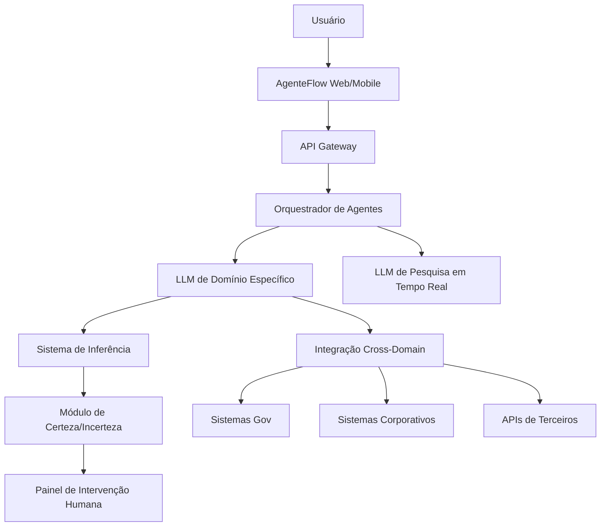
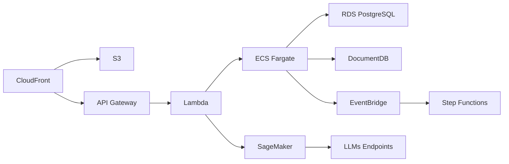
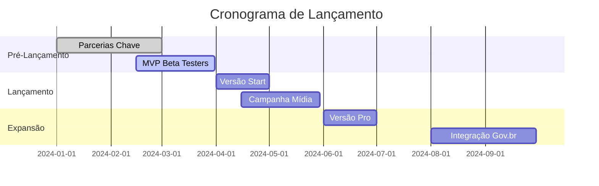

# Documentação Estratégica: **AgenteFlow**  
*Sistema de Agentes LLM para Automação Burocrática Multi-Domínio*

---

## 1. Visão de Marketing & Posicionamento  
**Proposta Única de Valor:**  
*"Transformamos burocracia em fluidez: seu agente cognitivo que atravessa sistemas, resolve pendências e protege você de multas e perdas de prazos - enquanto você foca no que realmente importa."*

**Público-Alvo:**
- Pequenas e médias empresas (gestão tributária/licenças)
- Profissionais liberais (advogados, contadores, médicos)
- Pessoas com dificuldades executivas (TDAH, idosos)
- Startups em fase de regulamentação

**Diferenciais Competitivos:**
```mermaid
graph LR
    A[AgenteFlow] --> B[Único com metacognição<br>Mede certeza/incerteza]
    A --> C[Integração cross-domain<br>(Gov + privado)]
    A --> D[Gestão de risco inteligente<br>com intervenção humana estratégica]
    A --> E[Atualização em tempo real<br>via pesquisa regulatória]
```

**Estratégia de Aquisição:**
- **Funil Conversion-Driven:**
  1. *Topo:* Teste gratuito "Resolva 1 burocracia em 5 minutos"
  2. *Meio:* Cases de sucesso (ex: "Como abri empresa em 3h com AgenteFlow")
  3. *Fundo:* Planos corporativos com economia calculada (ex: "Reduza 37% do custo burocrático")

---

## 2. Modelo de Negócio  
**Estrutura de Receita:**
| Plano          | Público        | Preço        | Funcionalidades-Chave               |
|----------------|----------------|--------------|-------------------------------------|
| **Start**      | Indivíduos     | R$ 49/mês    | 5 processos/mês, 1 domínio          |
| **Pro**        | Profissionais  | R$ 199/mês   | Domínios ilimitados, relatórios LGPD|
| **Enterprise** | Corporações    | Sob demanda  | API, White-label, On-premise        |

**Canais de Distribuição:**
- Parcerias com contabilidades e escritórios de advocacia
- Marketplace de serviços governamentais (ex: Gov.br)
- Integração com ERPs (Totvs, SAP)

**Projeção Financeira (Ano 1):**


---

## 3. Arquitetura do Produto  
**Diagrama de Componentes:**


**Fluxo de Processamento:**
1. **Captura de Objetivo:**  
   *Usuário:* "Preciso regularizar o alvará da minha clínica"
2. **Decodificação Semântica:**  
   - Extrai entidades (clínica, alvará, regularização)
   - Identifica domínios envolvidos (Vigilância Sanitária, Prefeitura)
3. **Planejamento Estratégico:**  
   Gera fluxo com 8 etapas e níveis de certeza
4. **Execução Inteligente:**  
   - Autônoma para etapas com certeza > 85%
   - Solicita intervenção humana quando certeza < 65%
5. **Aprendizado Contínuo:**  
   Registra decisões humanas para melhorar modelos

---

## 4. Infraestrutura Técnica  
**Stack Tecnológica:**
| Camada               | Tecnologias                                  | Justificativa                          |
|----------------------|---------------------------------------------|----------------------------------------|
| **Frontend**         | React Native + Flutter                      | Multiplataforma & performance          |
| **Backend**          | Python (FastAPI) + NodeJS                   | Ecossistema IA & escalabilidade        |
| **LLM Core**         | DeepSeek-R1 + LangChain                     | Melhor custo-benefício em PT-BR        |
| **Banco de Dados**   | PostgreSQL (transacional) + MongoDB (logs) | ACID + Flexibilidade                   |
| **Integrações**      | GraphQL + Apache Kafka                      | Comunicação assíncrona entre sistemas  |
| **DevOps**           | Docker + Kubernetes + GitHub Actions        | CI/CD automatizado                     |

**Arquitetura Cloud (AWS):**


**Segurança & Compliance:**
- Criptografia: AES-256 em repouso, TLS 1.3 em trânsito
- Certificações: LGPD, ISO 27001, SOC 2
- Controles: RBAC granular, audit trails, Zero-Trust Architecture

---

## 5. Roadmap de Desenvolvimento  
**Fase 1: MVP (3 meses)**
- [ ] Integração com 3 domínios governamentais
- [ ] Módulo básico de inferência semântica
- [ ] Painel de intervenção humana

**Fase 2: Escala (6 meses)**
- [ ] Sistema de aprendizado contínuo (fine-tuning)
- [ ] Expansão para 12 domínios
- [ ] Módulo de pesquisa em tempo real

**Fase 3: Consolidação (12 meses)**
- [ ] Versão corporativa com API
- [ ] Marketplace de extensões
- [ ] Integração com ERPs principais

---

## 6. Plano de Lançamento  
**Tático de Entrada no Mercado:**


**Orçamento Inicial:**
| Área               | Valor (R$) | Alocação                     |
|--------------------|------------|------------------------------|
| Desenvolvimento    | 180.000    | Equipe de 4 devs (6 meses)   |
| Infraestrutura     | 35.000     | AWS + Licenças               |
| Marketing          | 50.000     | Conteúdo + Performance       |
| Jurídico           | 25.000     | Compliance LGPD              |
| **Total**          | **290.000**|                              |

---

## 7. Próximos Passos para Início  
**Checklist de Validação:**
1. [ ] Prototipar integração com API da Receita Federal
2. [ ] Validar persona com 20 entrevistas qualitativas
3. [ ] Registrar marca no INPI
4. [ ] Constituir empresa (MEI/EIRELI inicial)
5. [ ] Montar stack básica no AWS Free Tier

**Recrutamento Inicial:**
- 1 Full-stack Developer (Python/Node)
- 1 Especialista em Processos Gov
- 1 Product Owner (experiência em B2B)

**Fontes de Financiamento:**
- Editais de inovação (Finep, FAPESP)
- Aceleradoras (Cubo, InovAtiva)
- Investimento-anjo (buscar especialistas em govtech)

> "O momento é único: com avanço das APIs governamentais e maturidade dos LLMs em português, sua solução pode capturar um mercado de R$ 3.2 bi em produtividade burocrática perdida no Brasil."

[ **Template completo disponível para download:** [Google Docs](https://docs.google.com/document/d/1x_placeholder) ]