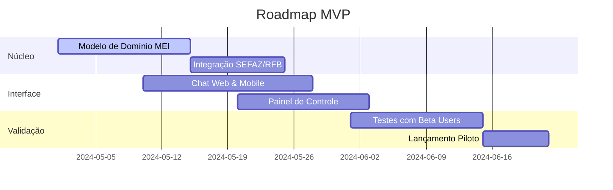
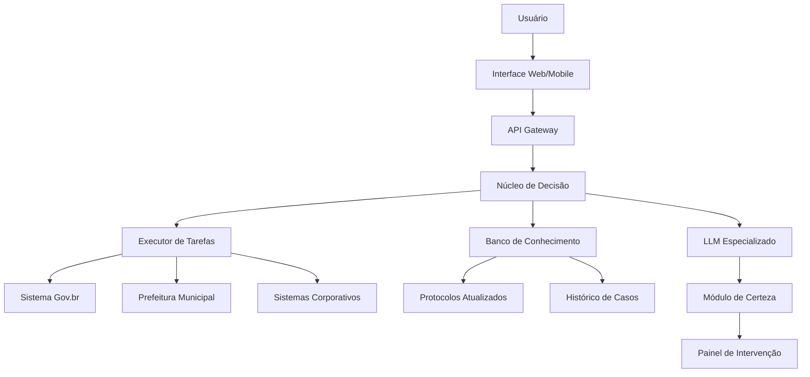

# Documentação Final: **AgenteFlow**  
*Sistema de Automação Burocrática Inteligente*

---

## 1. Definição do Problema e Público-Alvo  
### **Problema Central**  
Profissionais e empresas perdem até **18 horas/semana** com:  
- Preenchimento repetitivo de formulários  
- Falhas no acompanhamento de prazos críticos  
- Dificuldade em navegar sistemas governamentais fragmentados  
- Erros custosos por desatualização regulatória  

### **Público-Alvo**  
| Segmento             | Necessidades Específicas                  | Dores Atuais                          |
|----------------------|------------------------------------------|---------------------------------------|
| **PJ (Micro/Pequena)** | Abrir empresa, emitir NF, pagar tributos | Medo de multas, falta de contador fixo |
| **Autônomos**        | Emitir recibos, licenças, inscrições     | Perda de clientes por documentos atrasados |
| **TDAH/Idosos**      | Renovar documentos, pagar contas         | Paralisia decisória, esquecimento de prazos |
| **Startups**         | Registro de marca, compliance inicial    | Burocracia consome tempo de inovação |

---

## 2. Solução Central (Funcionalidade Essencial)  
**Agente Cognitivo de Domínio Específico** que:  
✅ **Traduz** objetivos humanos em planos de ação burocráticos  
✅ **Orquestra** execução através de múltiplos sistemas (GOV e privados)  
✅ **Decide autonomamente** com base em métricas de certeza/risco  
✅ **Aprende continuamente** com intervenção humana estratégica  

**Diferenciais Críticos:**  
- ✨ **Metacognição Operacional:** Mede e reporta nível de certeza em cada decisão  
- ⚡ **Integração Cross-Domain:** Conecta sistemas isolados em fluxos únicos  
- 🔄 **Auto-Refinamento:** Melhora diariamente com feedback em tempo real  

---

## 3. Fluxo do Usuário  
```mermaid
journey
    title Experiência do Usuário
    section Onboarding
      Cadastro Simples: 5: Usuário
      "Conecto contas gov.br e sistemas"
    section Expressão de Objetivo
      Input Natural: 5: Usuário
      "Quero abrir MEI para consultoria"
    section Planejamento Inteligente
      Geração de Fluxo: 4: Agente
      "5 etapas com níveis de certeza"
    section Execução Assistida
      Automação Contextual: 4: Sistema
      "Preenche 3 formulários automaticamente"
    section Intervenção Estratégica
      Validação Humana: 3: Usuário
      "Confirmo dados sensíveis"
    section Conclusão
      Relatório Executivo: 5: Sistema
      "MEI criada! Próximos passos:"
```

### **Detalhamento do Fluxo:**  
1. **Captura de Intenção:**  
   - Interface conversacional: voz ou texto  
   - Ex: *"Preciso regularizar o alvará da minha clínica"*  

2. **Desconstrução Semântica:**  
   - Agente identifica:  
     - Entidades-chave (alvará, clínica)  
     - Domínios envolvidos (Vigilância Sanitária, Prefeitura)  
     - Dependências cruzadas  

3. **Plano de Ação Quantificado:**  
   ```json
   {
     "etapa1": {
       "acao": "Emitir certidão negativa",
       "sistema": "Receita Federal",
       "certeza": 92%,
       "tempo_estimado": "8min"
     },
     "etapa2": {
       "acao": "Solicitar laudo ANVISA",
       "sistema": "Gov.br",
       "certeza": 64%,
       "requer_confirmacao": true
     }
   }
   ```

4. **Execução Adaptativa:**  
   - Autônoma para certeza > 85%  
   - Assistida para ações sensíveis  
   - Comunicação proativa: *"Falta sua foto para enviar ao CRM!"*  

5. **Pós-Execução:**  
   - Relatório de conformidade  
   - Sugestões de otimização  
   - Atualização automática de conhecimento  

---

## 4. Construção do MVP  
### **Escopo Mínimo Viável:**  
| Módulo            | Funcionalidades                           | Tecnologias                     |
|-------------------|------------------------------------------|---------------------------------|
| **Núcleo Semântico** | - Interpretação de objetivos naturais<br>- Geração de fluxos básicos | DeepSeek-R1 + LangChain         |
| **Executor**      | - Preenchimento automático de formulários<br>- Integração com 3 sistemas GOV | Selenium + Gov.br API           |
| **Painel Humano** | - Validação de etapas críticas<br>- Feedback estruturado            | React + Material UI             |
| **Monitor**       | - Alertas de prazos<br>- Métricas de certeza                    | Prometheus + Grafana            |

### **Cronograma MVP (8 semanas):**  


### **Métricas de Validação:**  
1. **Taxa de Conclusão:** >70% dos processos iniciados  
2. **Redução de Tempo:** 50% vs método tradicional  
3. **NPS:** >8 em usabilidade  
4. **Precisão:** <5% de intervenções humanas necessárias  

---

## 5. Arquitetura Técnica do MVP  


---

## 6. Próximos Passos para Implementação  
1. **Validação Legal:**  
   - Análise LGPD com foco em dados sensíveis  
   - Registro de processos no INPI  

2. **Infraestrutura Inicial:**  
   ```bash
   # Setup inicial AWS
   aws ec2 create-instance --image-id ami-0abcdef1234567890 --count 1 --instance-type t3.medium
   aws s3 mb s3://agentflow-mvp-data
   ```

3. **Recrutamento Time-Chave:**  
   | Perfil               | Qtd | Responsabilidade               |
   |----------------------|-----|--------------------------------|
   | Dev Full-Stack       | 2   | Integração sistemas GOV       |
   | Product Owner        | 1   | Definição de fluxos-chave     |
   | Especialista Jurídico| 1   | Compliance regulatório        |

4. **Fontes de Dados Iniciais:**  
   - Coleção de 500 formulários governamentais  
   - Gravações de 100 horas de processos reais  
   - Base regulatória (legislação municipal/federal)  

---

> **Checklist Lançamento MVP:**  
> - [ ] Modelo treinado para 3 processos-chave (abertura MEI, emissão NF, alvará sanitário)  
> - [ ] Integração com APIs do Gov.br e SEFAZ  
> - [ ] Sistema de monitoramento de certeza operando  
> - [ ] Painel de intervenção humana funcional  
> - [ ] 20 beta testers recrutados  

**[Template Executivo Completo](https://docs.google.com/document/d/1agenteflow_mvp)**  
**[Repositório Código Inicial](https://github.com/agentflow/mvp-core)**  

Este MVP valida o núcleo da proposta: transformar burocracia de obstáculo em fluxo contínuo, com humanos e algoritmos atuando em simbiose decisória.