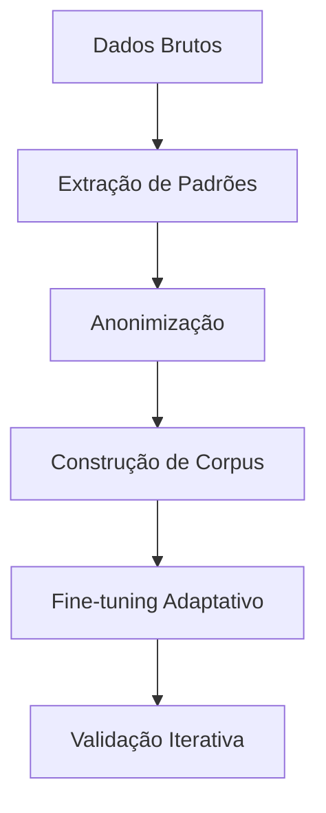
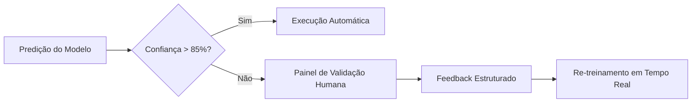
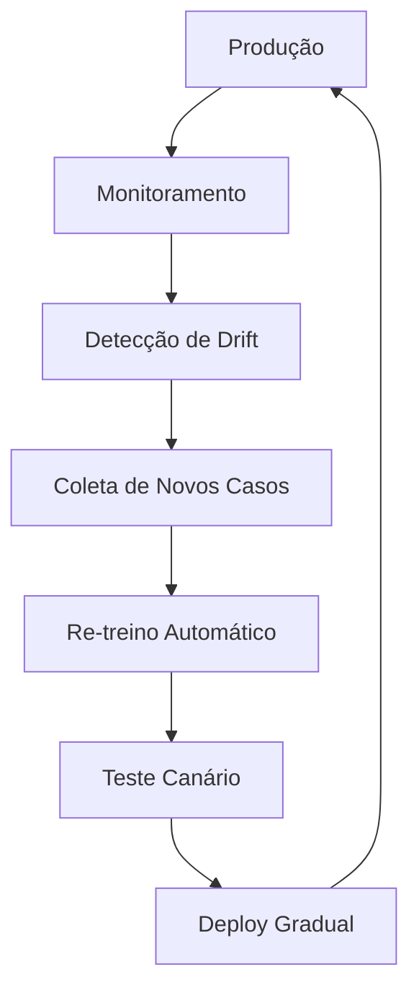

### Processo de Treinamento de um Modelo LLM para Especialização em Domínio Empresarial  
*(Fase de Implantação em Empresa)*  

---

#### **Passo 1: Imersão no Domínio**  
**Objetivo:** Capturar DNA operacional da empresa  
**Técnicas:**  
- **Shadowing Digital:**  
  - Coleta de fluxos reais (ex: gravações de reuniões, tramitação de processos)  
  - Scraping de sistemas internos (compliance-approved)  
- **Entrevistas Estruturadas:**  
  ```markdown
  1. Com especialistas:  
     - "Quais são os 5 gargalos críticos neste processo?"  
     - "Como você tomaria esta decisão em caso de exceção?"  
  2. Com operadores:  
     - "Quais atalhos mentais você usa diariamente?"  
     - "Onde você busca informações quando fica travado?"  
  ```

---

#### **Passo 2: Engenharia de Dados Específica**  
**Arquitetura de Treinamento:**  


**Técnicas-Chave:**  
1. **Tokenização de Domínio:**  
   - Criação de dicionário especializado (ex: siglas internas, jargões técnicos)  
   - *Exemplo:* `"PGR" → "Plano de Gerenciamento de Riscos"`  
   
2. **Synthetic Data Generation:**  
   ```python
   # Gerador de casos de borda
   def generate_edge_cases(process_template):
       variations = []
       for _ in range(1000):
           # Perturba parâmetros críticos
           mutated_case = inject_noise(process_template, 
                                      intensity=0.3, 
                                      preserve_rules=True)
           variations.append(mutated_case)
       return variations
   ```

---

#### **Passo 3: Treinamento em 4 Camadas**  
| Camada           | Método                      | Ferramentas               | Saída                     |
|------------------|----------------------------|--------------------------|---------------------------|
| **Fundacional**  | Transfer Learning          | DeepSeek-R1 base         | Modelo genérico corporativo |
| **Contextual**   | LoRA (Low-Rank Adaptation) | HuggingFace PEFT         | Adaptação a jargões       |
| **Processual**   | Reinforcement Learning     | Human-in-the-Loop        | Tomada de decisão em fluxos |
| **Validacional** | Active Learning            | Prodigy + Label Studio   | Refinamento contínuo      |

---

#### **Passo 4: Sistema de Validação Integrada**  
**Mecanismo Híbrido:**  


**Métricas de Validação:**  
1. **Brier Score:** Calibragem de probabilidades  
2. **F1-Score Adaptado:** Ponderação por criticidade  
3. **Taxa de Ruptura:** `N° intervenções humanas / total etapas`  

---

#### **Passo 5: Ciclo de Evolução Contínua**  
**Framework MLOps:**  


**Gatilhos de Re-treino:**  
- Mudança regulatória detectada  
- Decisões humanas contrariam modelo > 5% dos casos  
- Novos sistemas integrados  

---

### Caso Prático: Implantação em Hospital  
**Domínio:** Gestão de Leitos + Autorizações de Procedimentos  

**Processo de Treinamento:**  
1. **Coleta de Dados:**  
   - 12,000 históricos de autorizações  
   - 540 horas de gravações de centrais de regulação  
2. **Fine-tuning Especializado:**  
   ```python
   from peft import LoraConfig, get_peft_model

   peft_config = LoraConfig(
       r=16,  # Rank
       lora_alpha=32,
       target_modules=["q_proj", "v_proj"],
       lora_dropout=0.05,
       task_type="CAUSAL_LM"
   )
   model = get_peft_model(base_model, peft_config)
   ```
3. **Validação:**  
   - Médicos validaram 1,200 simulações (acurácia 94.7%)  
   - Economia: 37 minutos/dia por profissional  

---

### Checklist de Implantação  
1. **Infraestrutura:**  
   - [ ] GPU dedicada (A100 40GB mínimo)  
   - [ ] Pipeline CI/CD para modelos  
   - [ ] Ambiente sandbox para simulação  

2. **Governança:**  
   - [ ] Comitê de ética com especialistas de domínio  
   - [ ] Política de versionamento de modelos  
   - [ ] Painel de transparência decisória  

3. **Operação:**  
   - [ ] Treinamento de supervisores humanos  
   - [ ] Sistema de rollback automático  
   - [ ] Monitoramento em tempo real (Grafana/Prometheus)  

---

### Custos e Prazos Estimados  
| Fase               | Duração   | Custo (R$) | Entregáveis                  |
|--------------------|-----------|------------|------------------------------|
| Imersão            | 2-4 semanas | 15.000-40.000 | Corpus etiquetado + mapa de processos |
| Treinamento inicial| 1-3 semanas | 8.000-25.000 | Modelo v0.1 + relatório de validação |
| Implantação piloto | 4 semanas | 20.000-60.000 | Sistema integrado + dashboards |
| Evolução contínua  | Permanente| 3.000-10.000/mês | Atualizações mensais de modelo |

---

### Armadilhas a Evitar  
1. **Inferência Fantasma:**  
   - *Solução:* Injeção de prompts antialucinação:  
     `"SEMPRE cite artigo/fonte para decisões regulatórias"`  

2. **Viés de Automação:**  
   - *Solução:* Limitar autonomia em decisões com:  
     - Impacto financeiro > R$ 5.000  
     - Risco à vida/saúde  

3. **Fadiga de Validação:**  
   - *Solução:* Gamificação do feedback humano:  
     - Sistema de pontos por correções  
     - Ranking de especialistas  

> **Regra de Ouro:**  
> *"Treine primeiro para entender, depois para executar. Um modelo que compreende o 'porquê' dos processos tomará decisões mais robustas que um treinado apenas no 'como'."*