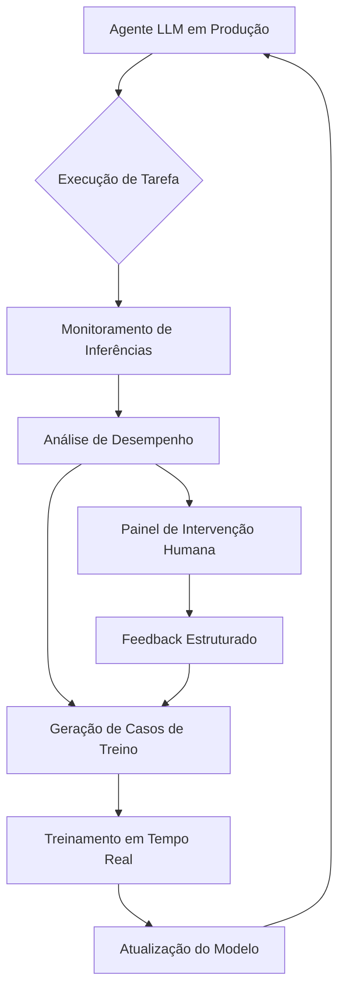
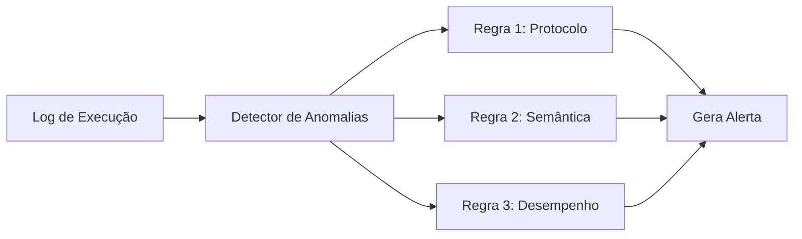
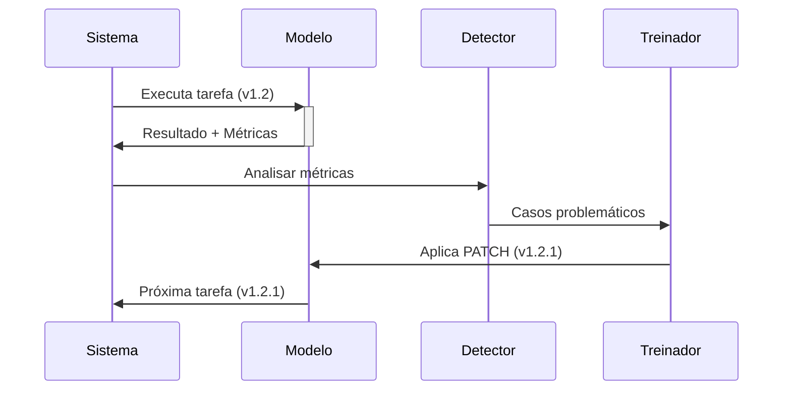
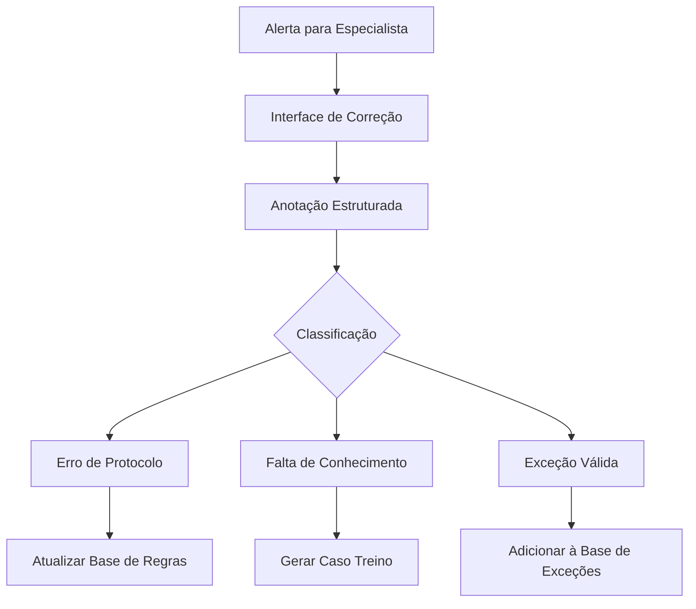

### **Processo de Treinamento em Tempo Real com Auto-Refinamento Contínuo**  
*(Sistema de Aprendizado Adaptativo para Agentes LLM)*  

---

### **Arquitetura do Sistema**  


---

### **Fluxo de Aprendizado em Tempo Real**  

#### **Passo 1: Inferência Metrificada**  
Durante a execução de cada tarefa, o agente gera:  
- **Score de Certeza** (0-100%): Confiança na decisão  
- **Mapa de Compatibilidade**: Alinhamento com protocolos  
- **Risco Operacional**: Impacto potencial de erro  

```python
# Exemplo de saída durante planejamento
def inferir_acao(tarefa, contexto):
    acao = llm.predict(tarefa, contexto)
    certeza = calcular_certeza(acao, historico_similar)
    compatibilidade = verificar_compatibilidade(acao, protocolos)
    risco = estimar_risco(acao, criticidade_tarefa)
    
    return {
        "acao": acao,
        "metricas": {
            "certeza": certeza,          # ex: 78.4
            "compatibilidade": compatibilidade, # ex: 92/100
            "risco": risco               # ex: "Médio"
        },
        "gatilhos_intervencao": ["certeza < 65", "risco == Alto"]
    }
```

---

#### **Passo 2: Monitoramento Automático**  
Sistema detecta em tempo real:  
1. **Desvios de Protocolo**  
   - Ex: Uso de formulário obsoleto  
2. **Inconsistências Semânticas**  
   - Ex: "Emitir certidão" vs "Solicitar certidão"  
3. **Eficiência Operacional**  
   - Tempo de execução vs benchmark  



---

#### **Passo 3: Geração Automática de Casos de Treino**  
Quando métricas indicam problemas:  
```python
def gerar_caso_treinamento(execucao):
    if execucao.metricas.certeza < 65 or execucao.anomalia_detectada:
        caso = {
            "input": execucao.contexto_original,
            "output_esperado": especialista.corrigir(execucao.acao),
            "erro": execucao.desvio_identificado,
            "dificuldade": calcular_nivel_dificuldade(execucao)
        }
        adicionar_ao_dataset_treino(caso)
```

---

#### **Passo 4: Ciclo de Treinamento Contínuo**  
**Métodos Combinados:**  
| Técnica               | Frequência   | Casos de Uso                  |
|-----------------------|--------------|-------------------------------|
| **Online Learning**   | Imediato     | Correções críticas de protocolo |
| **Fine-tuning Delta** | Horária      | Adaptação incremental         |
| **Retreinamento**     | Diária       | Incorporação de novos padrões |

**Fluxo Técnico:**  


---

### **Mecanismos de Auto-Refinamento**  

#### 1. **Adaptação de Prompt Dinâmico**  
- Sistema ajusta instruções baseado em falhas recentes:  
  ```python
  if "erro_formulario" in historico_falhas:
      novo_prompt = prompt_base + "\nAVISO: Verificar versão atualizada do Form X no repositório central"
  ```

#### 2. **Memória de Contexto Evolutiva**  
- Banco de conhecimento atualizado automaticamente:  
  | Entidade          | Estado Anterior       | Estado Atual         | Fonte Atualização     |
  |-------------------|-----------------------|----------------------|------------------------|
  | Formulário Y      | Versão 2023           | Versão 2024 (jan)    | Diário Oficial 05/01   |

#### 3. **Sistema de Recompensas**  
- Modelo ajusta pesos internos baseado em feedback:  
  ```python
  if acao.sucesso:
      reforco_positivo(embedding_acao, fator=0.7)
  else:
      reforco_negativo(embedding_acao, fator=0.3)
  ```

---

### **Papel da Intervenção Humana**  
**Quando ocorre:**  
- Certeza < 60%  
- Risco operacional alto  
- Detecção de novo padrão não catalogado  

**Processo de feedback:**  


---

### **Caso Prático: Processo de Licitação**  
**Cenário:** Agente precisa gerenciar processo de compra hospitalar  

1. **Primeira Execução (v1.0):**  
   - Planeja fluxo baseado em protocolo genérico  
   - Certeza: 58% → Aciona especialista  

2. **Intervenção Humana:**  
   - Corrige: "Incluir etapa de homologação ANVISA"  
   - Classifica como "Erro de Protocolo Específico"  

3. **Atualização Automática:**  
   ```json
   {
     "versao_modelo": "1.1",
     "mudancas": [
       {
         "tipo": "nova_etapa",
         "processo": "Licitação Hospitalar",
         "etapa": "Homologação ANVISA",
         "posicao_fluxo": 5,
         "gatilho": "produtos médicos"
       }
     ]
   }
   ```

4. **Próxima Execução (v1.1):**  
   - Certeza: 92%  
   - Adiciona etapa automaticamente  

---

### **Tecnologias Habilitadoras**  
| Componente               | Tecnologias                                  |  
|--------------------------|---------------------------------------------|  
| **Monitoramento**        | Prometheus + Grafana + ELK Stack            |  
| **Treinamento Contínuo** | SageMaker Canvas + Hugging Face AutoTrain   |  
| **Versionamento**        | DVC (Data Version Control) + MLflow         |  
| **Feedback Estruturado** | Label Studio + Prodigy                      |  
| **Deploy Contínuo**      | Kubeflow Pipelines + Argo CD                |  

---

### **Métricas de Desempenho do Sistema**  
| Indicador               | Fórmula                                | Meta       |  
|-------------------------|----------------------------------------|------------|  
| **Taxa de Autoaprendizado** | `Casos resolvidos sem intervenção / Total` | > 85%      |  
| **Velocidade de Adaptação** | `Tempo correção → Deploy`              | < 15 min   |  
| **Precisão Contextual** | `F1-Score em validações humanas`       | > 0.93     |  
| **Redução de Erros**    | `(Erros v1 - Erros v2) / Erros v1`     | > 40%      |  

---

### **Vantagens Competitivas**  
1. **Resiliência Operacional:**  
   - Adapta-se a mudanças regulatórias em horas, não semanas  

2. **Customização Progressiva:**  
   - Modelo torna-se especialista único da organização  

3. **Redução de Custos:**  
   - Diminuição exponencial de intervenções humanas  

> **Implementação Estratégica:**  
> Iniciar com domínios de médio risco (ex: RH, licitações de baixo valor), utilizando arquitetura híbrida onde:  
> - 20% do tráfego usa versão experimental  
> - Modelo canário é testado em paralelo  
> - Rollback automático se precisão cair > 5%  

Este sistema transforma o Agente LLM em um "colaborador algorítmico" que evolui com a organização, convertendo cada interação em oportunidade de refinamento mútuo entre humanos e máquinas.